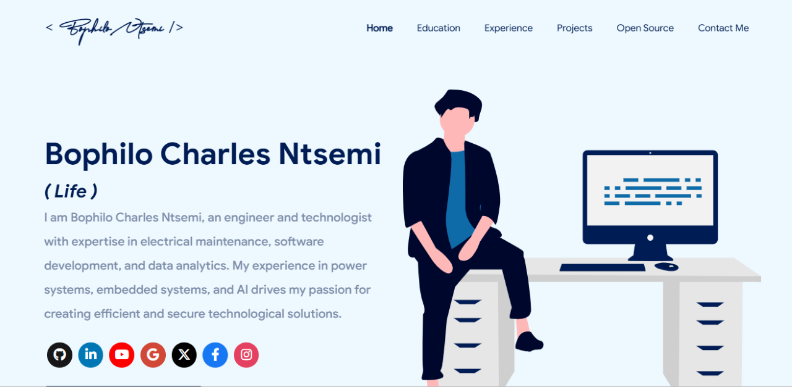

 
    </img>

<h1 align="center"> Portfolio for Ntsemi Charles Bophilo🔥 </h1> 
<h3 align="center"> A customizable portfolio   template Suitable for Software Developers! </h3>

  
  
  
  
  
   
  
  
  

<!--
If you want to discuss about something, you can ask on my <a href="https://discord.com/invite/GkcbM5bwZr">Discord Server</a>.
 -->

 
    <a href="https://bophelo99.github.io" target="_blank">
    <!--</img> -->
  </a>

